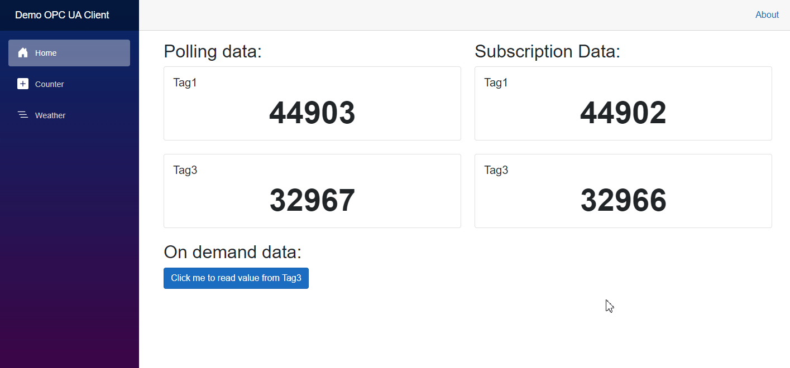

# Project Documentation

## Summary
This project demonstrates how to create an OPC UA client using the OPC Foundation [.NET Standard Opc.Ua.Client library](https://www.nuget.org/packages/OPCFoundation.NetStandard.Opc.Ua.Client). It includes functionalities such as polling, subscribing to, and manually reading values from OPC UA server nodes. The provided services in this example are not limited to .NET 8 and Blazor; they are applicable to any project built with .NET Core 3.0 or later, including .NET 5 and newer versions.

## Main Features
- Connect to an OPC UA server endpoint
- Subscribe to, poll, or manually read the values of specific nodes
- Display the values of the nodes in a Blazor Server application



## Setup and Running the Project

### Step 1: Update Configuration
1. Update the `<ApplicationName>`, `<ApplicationUri>`, and `<ProductUri>` fields in the `ApplicationConfig.xml` file as needed.
2. Update `appsettings.json` with the correct endpoint URL and identity information to connect to your OPC UA server.

### Step 2: Build and Run the Project
1. Open the solution in your preferred .NET IDE (e.g., Visual Studio).
2. Build the project to ensure all dependencies are resolved.
3. Run the project.

### Step 3: Verify the Connection
1. Once the client is running, it will attempt to connect to the OPC UA server. If the connection is successful, you should see the subscription data change notifications in the console output. otherwise, refer to the Troubleshooting section.
2. Check the console output for any error messages or connection issues.

## Example of usage
### Register Services in Program.cs:

```csharp

builder.Services.Configure<OpcUaSettings>(builder.Configuration.GetSection("OpcUaSettings"));

builder.Services.AddScoped<OpcUaSessionProvider>();

builder.Services.AddTransient<OpcUaPollingService>();
builder.Services.AddTransient<OpcUaSubscriptionService>();

```

### Inject Services

```csharp
...
@inject OpcUaPollingService PollingService
@inject OpcUaSubscriptionService SubscriptionService
...

```

### Setup and use Polling and Subscription services

```csharp
@code {
    private string? pollingTag1Data = "...";
    private string? pollingTag3Data = "...";
    private string? subscriptionTag1Data = "...";
    private string? subscriptionTag3Data = "...";

    protected async override Task OnInitializedAsync()
    {
        // Setup Polling
        PollingService.OnDataChanged += HandleReceivedPollingData;
        
        NodeId[] nodeIds = new[] { new NodeId("Channel1.Device1.Tag1", 2), new NodeId("Channel1.Device2.Tag3", 2) };
        
        await PollingService.StartPollingAsync(nodeIds, 2000); // 2000 is the polling interval in milliseconds, it's optional and the default value is 1000

        // Setup Subscription
        SubscriptionService.OnSubscriptionDataChanged += HandleSubscriptionDataChanged;
        
        var monitoredItems = new[]
        {
            new MonitoredItem { DisplayName = "Channel1.Device1.Tag1", StartNodeId = new NodeId("Channel1.Device1.Tag1", 2) },
            new MonitoredItem { DisplayName = "Channel1.Device2.Tag3", StartNodeId = new NodeId("Channel1.Device2.Tag3", 2) }
        };
        
        await SubscriptionService.AddMonitoredItemAsync(monitoredItems);
    }

    private void HandleReceivedPollingData(NodeId nodeId, DataValue value)
    {
        Console.WriteLine($"Data from Polling: {nodeId.Identifier.ToString()} - {value.Value?.ToString()}");
        
        switch (nodeId.Identifier.ToString())
        {
            case "Channel1.Device1.Tag1":
                pollingTag1Data = value.Value?.ToString();
                break;
            case "Channel1.Device2.Tag3":
                pollingTag3Data = value.Value?.ToString();
                break;
        }
        
        InvokeAsync(StateHasChanged);
    }

    private void HandleSubscriptionDataChanged(string displayName, DataValue dataValue)
    {
        switch (displayName)
        {
            case "Channel1.Device1.Tag1":
                subscriptionTag1Data = dataValue.Value?.ToString();
                break;
            case "Channel1.Device2.Tag3":
                subscriptionTag3Data = dataValue.Value?.ToString();
                break;
        }
        
        InvokeAsync(StateHasChanged);
    }

    public async ValueTask DisposeAsync()
    {
        PollingService.OnDataChanged -= HandleReceivedPollingData;
        await PollingService.DisposeAsync();
        SubscriptionService.OnSubscriptionDataChanged -= HandleSubscriptionDataChanged;
        await SubscriptionService.DisposeAsync();
    }
}
```

### Read node value on demand

```csharp

// Example of manual read node value (read on demand)
var nodeIdToRead = new NodeId("Channel1.Device1.Tag1");
var session = await opcUaSessionProvider.CreateSessionAsync();
var readValue = await session.ReadValueAsync(nodeIdToRead);

if (readValue != null && StatusCode.IsGood(readValue.StatusCode))
{
    Console.WriteLine($"Manual Read - NodeId: {nodeIdToRead}, Value: {readValue.Value}");
}
else
{
    Console.WriteLine($"Failed to read value for NodeId: {nodeIdToRead}");
}

```

## Create service instances manually if you need more control over the services.

```csharp

var loggerFactory = serviceProvider.GetRequiredService<ILoggerFactory>();
var opcUaSettings = serviceProvider.GetRequiredService<IOptions<OpcUaSettings>>().Value;
var opcUaSessionProvider = serviceProvider.GetRequiredService<OpcUaSessionProvider>();

var opcUaPollingService = new OpcUaPollingService(opcUaSessionProvider, loggerFactory);
var opcUaSubscriptionService = new OpcUaSubscriptionService(opcUaSessionProvider, loggerFactory);

// Define the NodeIds to be polled and subscribed
var nodeIdsToPoll = new NodeId[]
{
    new NodeId("Channel1.Device1.Tag1"),
    new NodeId("Channel1.Device2.Tag3")
};

// Register the data changed event handler for polling
opcUaPollingService.OnDataChanged += (nodeId, dataValue) =>
{
    Console.WriteLine($"Polling Data Changed - NodeId: {nodeId}, Value: {dataValue.Value}");
};

// Start polling the nodes
await opcUaPollingService.StartPollingAsync(nodeIdsToPoll, 1000);

// Define the monitored items for subscription
var monitoredItems = new MonitoredItem[]
{
    new MonitoredItem { DisplayName = "Channel1.Device1.Tag1", StartNodeId = "Channel1.Device1.Tag1" },
    new MonitoredItem { DisplayName = "Channel1.Device2.Tag3", StartNodeId = "Channel1.Device2.Tag3" }
};

// Register the data changed event handler for monitored items
opcUaSubscriptionService.OnSubscriptionDataChanged += (displayName, dataValue) =>
{
    Console.WriteLine($"Subscription Data Changed - DisplayName: {displayName}, Value: {dataValue.Value}");
};

// Add monitored items to the subscription
await opcUaSubscriptionService.AddMonitoredItemAsync(monitoredItems);

```

## Troubleshooting
- Ensure that the OPC UA server is running and accessible.
- Verify that the self-signed certificate is correctly added to the trust list.
    1. Run the OPC UA Configuration Manager.
    2. Navigate to the "Trust List" section.
    3. Manually add the self-signed certificate generated by your client to the trust list.

- Verify that the endpoint URL is correct and that the OPC UA server is reachable.
- Check the console output for any error messages or connection issues.